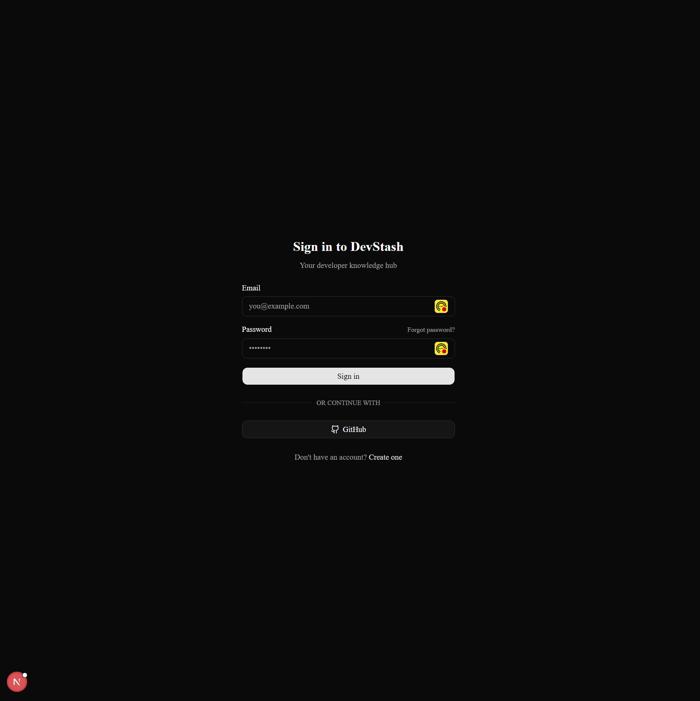
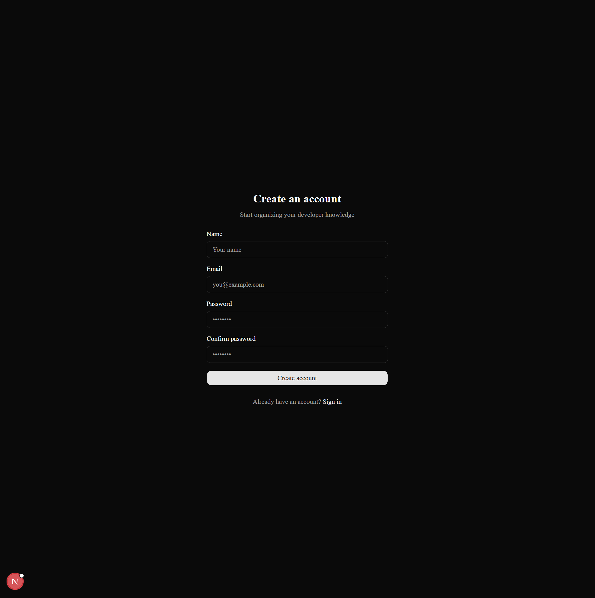
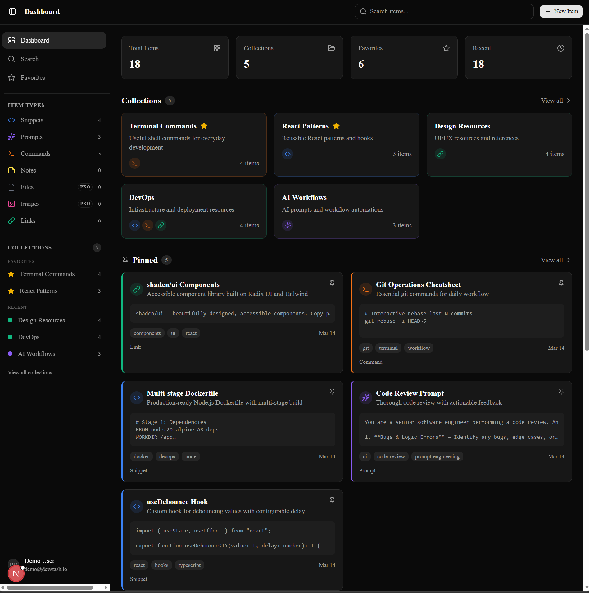

# DevStash

**Access Live Demo:** [https://devstash-liard.vercel.app/](https://devstash-liard.vercel.app/)



DevStash is a modern, comprehensive universal stash manager built specifically for developers. Save, organize, and quickly retrieve your code snippets, terminal commands, AI prompts, vital links, and essential files all in one secure place.

## Features

- **Store Everything:** Save code snippets, CLI commands, AI prompts, text notes, images, links, and uploaded files.
- **Smart Organization:** Group your items into custom Collections and attach Tags for lightning-fast retrieval. 
- **Cloud Storage:** Native integration with Cloudflare R2 for fast and reliable file storing.
- **Favorites & Pins:** Pin your most frequently used items to the top or mark them as favorites for easy access.
- **Developer-First UI:** Built with Tailwind CSS 4, Shadcn UI, and Base UI for a highly polished, responsive, and keyboard-accessible experience.
- **Secure Authentication:** Integrated NextAuth.js (v5) providing robust authentication.
- **Rate-Limiting & Caching:** Powered by Upstash Redis and Upstash Ratelimit to ensure application stability and speed.

## Tech Stack

This project is built using bleeding-edge web technologies:

- **Framework:** [Next.js 16](https://nextjs.org/) (App Router)
- **Library:** [React 19](https://react.dev/)
- **Language:** [TypeScript](https://www.typescriptlang.org/)
- **Database:** [Neon](https://neon.tech/) Serverless PostgreSQL with [Prisma ORM](https://www.prisma.io/)
- **Authentication:** [NextAuth.js (v5 beta)](https://nextjs.authjs.dev/)
- **State Management:** [Zustand](https://zustand-demo.pmnd.rs/)
- **Styling:** [Tailwind CSS 4](https://tailwindcss.com/)
- **UI Components:** [Shadcn UI](https://ui.shadcn.com/) & [@base-ui/react](https://base-ui.com/)
- **Caching & Rate Limiting:** [Upstash Redis](https://upstash.com/)
- **Transactional Emails:** [Resend](https://resend.com/)

## Core Services Explained

To maintain high performance, reliability, and ease of deployment, DevStash relies on specialized serverless and cloud technologies:

### [Neon (Serverless PostgreSQL)](https://neon.tech/)
Neon is a fully managed serverless PostgreSQL platform. We use it as our primary database and taking advantage of its ability to scale storage and compute separately. It enables instant provisioning and branching, which perfectly matches DevStash's modern Next.js serverless architecture.

### [Upstash (Redis & Rate Limiting)](https://upstash.com/)
Upstash provides a serverless Redis database that scales to zero and is priced per request. DevStash uses it for two critical functions:
- **Rate Limiting:** Protects our API routes (like authentication and resource creation) from abuse or automated polling.
- **Caching:** Caches frequent queries and transient state, speeding up the application dramatically and offloading pressure from the primary Neon database.

### [Resend (Transactional Emails)](https://resend.com/)
Resend is an API-first framework for building and sending emails. DevStash uses it for secure, fast, and reliably delivered transactional emails, such as magic links for authentication or notifications, utilizing their modern React Email templates for elegant design.

## Screenshots

### Dashboard


### Collections & Tags



## Getting Started

### Prerequisites
- Node.js (v20 or higher)
- PostgreSQL Database
- Upstash Redis account
- Cloudflare R2 account (for file storage)
- Resend account (for emails)

### Installation

1. Clone the repository:
   ```bash
   git clone https://github.com/your-username/devstash.git
   cd devstash
   ```

2. Install dependencies:
   ```bash
   npm install
   ```

3. Set up your environment variables:
   Copy `.env.example` to `.env` and fill in your configuration:
   ```bash
   cp .env.example .env
   ```

4. Initialize the database:
   ```bash
   # Generate Prisma client
   npm run db:generate
   
   # Run migrations
   npm run db:migrate
   
   # Seed default data
   npm run db:seed
   ```

5. Start the development server:
   ```bash
   npm run dev
   ```

Your app should now be running on [http://localhost:3000](http://localhost:3000).

## Project Structure

- `/src/app` - Next.js App Router pages and API routes
- `/src/components` - Reusable UI components
- `/src/context` - React Context providers
- `/src/docs` - Additional documentation
- `/src/generated` - Generated files (Prisma Client)
- `/prisma` - Database schema and seed files
- `/public` - Static assets
- `/preview` - Application screenshots

## Database Schema

DevStash's foundation is built around specific core entities:
- **User / Accounts:** Managed by NextAuth.
- **Item:** The core resource holding your data (snippets, files, prompts).
- **ItemType:** Tracks the category of the item (Snippet, Command, File).
- **Collection / Tags:** Organizational entities linked to items.

Check `prisma/schema.prisma` for the full data model details.

## Learn More

To learn more about the tools used in this project:

- [Next.js Documentation](https://nextjs.org/docs) 
- [Prisma Documentation](https://www.prisma.io/docs)
- [Tailwind CSS v4](https://tailwindcss.com/docs)
- [NextAuth.js Docs](https://authjs.dev/reference/nextjs)

## License

This project is licensed under the MIT License.
