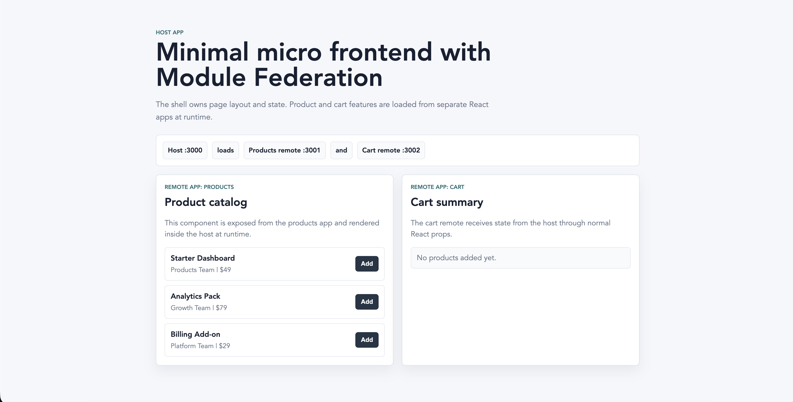

# Micro Frontend Module Federation

This folder contains three minimal React apps created with `npm create rsbuild@latest`:

- `host` runs on `http://localhost:3000`
- `products` remote runs on `http://localhost:3001`
- `cart` remote runs on `http://localhost:3002`

The host loads UI from the two remotes at runtime using Rsbuild's built-in Module
Federation support.

Each app also installs `@module-federation/runtime-tools`, which Rsbuild needs
when Module Federation is enabled.

## Preview



## Rspack, Rsbuild, and the runtime package

Rsbuild is built on top of Rspack. Rspack provides the Module Federation build
feature, so we can configure federation directly in `rsbuild.config.ts` with
`moduleFederation.options`.

We still install `@module-federation/runtime-tools` separately because Module
Federation is not only a build-time feature. At runtime, the host must load
`remoteEntry.js`, resolve exposed modules, initialize shared dependencies, and
handle the federation container lifecycle. Rsbuild/Rspack expects that runtime
package to be available when Module Federation is enabled.

Interview-friendly answer: Rspack gives us the bundler-level Module Federation
support, and `@module-federation/runtime-tools` provides the browser runtime code
needed to actually load and connect the federated apps.

## Run the example

Install dependencies in each app if needed:

```bash
cd host && npm install
cd ../products && npm install
cd ../cart && npm install
```

From this folder, start all apps:

```bash
npm run dev
```

Open the host at [http://localhost:3000](http://localhost:3000).

You can also run each app alone:

```bash
cd products && npm run dev
cd cart && npm run dev
cd host && npm run dev
```

## What is a micro frontend?

A micro frontend splits a frontend into smaller independently built apps. It is
similar to backend microservices, but for browser UI.

In this example:

- `host` is the shell. It owns layout, navigation, and page-level state.
- `products` owns the product feature.
- `cart` owns the cart feature.

Each app can be developed and deployed separately as long as the runtime contract
between host and remote stays compatible.

## What is Module Federation?

Module Federation lets one JavaScript build load code from another JavaScript
build at runtime.

Important terms:

- `host`: the app that consumes remote modules.
- `remote`: an app that exposes modules to other apps.
- `exposes`: modules a remote makes public.
- `remotes`: remote apps the host knows how to load.
- `remoteEntry.js`: the small runtime file that tells the host where remote code lives.
- `shared`: dependencies that should be reused instead of duplicated.

## How this code works

### Products remote

File: `products/rsbuild.config.ts`

```ts
moduleFederation: {
  options: {
    name: 'products',
    filename: 'remoteEntry.js',
    exposes: {
      './ProductList': './src/ProductList',
    },
  },
}
```

The products app exposes `ProductList`. The host imports it with:

```ts
const ProductList = lazy(() => import("products/ProductList"));
```

### Cart remote

File: `cart/rsbuild.config.ts`

```ts
moduleFederation: {
  options: {
    name: 'cart',
    filename: 'remoteEntry.js',
    exposes: {
      './CartSummary': './src/CartSummary',
    },
  },
}
```

The cart app exposes `CartSummary`. The host passes cart items through normal
React props.

### Host app

File: `host/rsbuild.config.ts`

```ts
remotes: {
  products: 'products@http://localhost:3001/remoteEntry.js',
  cart: 'cart@http://localhost:3002/remoteEntry.js',
}
```

This tells the host where each remote is running.

## Why use `shared`?

All three apps use React. Without `shared`, the browser may download multiple
copies of React. That can increase bundle size and can cause runtime bugs.

This example marks React and React DOM as singleton shared dependencies:

```ts
shared: {
  react: { singleton: true },
  'react-dom': { singleton: true },
}
```

Meaning:

- `shared` tells Module Federation which packages should be reused across host
  and remotes instead of bundled independently everywhere.
- `react` is shared because all apps render React components.
- `react-dom` is shared because all apps use the same React DOM renderer.
- `singleton: true` means the runtime should use one instance of that package,
  not one copy per app.

This is especially important for React because hooks and context expect one
compatible React instance. Multiple React copies can cause bugs such as invalid
hook calls, broken context sharing, larger bundles, or version mismatch errors.

In interviews, say: shared singleton dependencies help every micro frontend use
one compatible copy of important framework libraries, especially React and
React DOM.

## Error handling

Remote loading can fail if:

- The remote server is down.
- The remote URL is wrong.
- The exposed module name changed.
- The deployed remote is incompatible with the host.

The host uses:

- `React.lazy` for runtime loading.
- `Suspense` for loading UI.
- `RemoteBoundary` for failure UI.
- `host/src/remotes.d.ts` for TypeScript declarations.

## Why each app has `bootstrap.tsx`

Module Federation initializes shared packages, such as React, through its runtime.
If the normal entry file imports React synchronously, the app can fail with
runtime error `#RUNTIME-006` because React was requested before the shared scope
finished initializing.

That is why each app uses this pattern:

```ts
// src/index.tsx
import("./bootstrap").catch((error: unknown) => {
  console.error("Failed to start app", error);
});
```

`bootstrap.tsx` contains the normal React render code. The dynamic import creates
an async boundary so Module Federation can initialize shared dependencies first.
The `catch` is not required by Module Federation itself, but it makes startup
failures visible and avoids editor/linter complaints about an unhandled promise.

The TypeScript configs also set `"module": "ESNext"`. Dynamic imports require an
ES module-compatible `module` setting; without it, editors can show `ts(1323)`
even though the bundler understands the code.

## Interview talking points

- Micro frontends are useful when teams need independent ownership and deploys.
- They add runtime complexity, so do not use them for every small app.
- The host should own composition and cross-feature state.
- Remotes should expose small, stable entry points.
- Shared dependencies need careful version management.
- Runtime failures must be handled because the host depends on remote URLs.
- Local development usually requires running the host and remotes together.

## Build

```bash
npm run build
```

The root build builds products first, then cart, then host.
