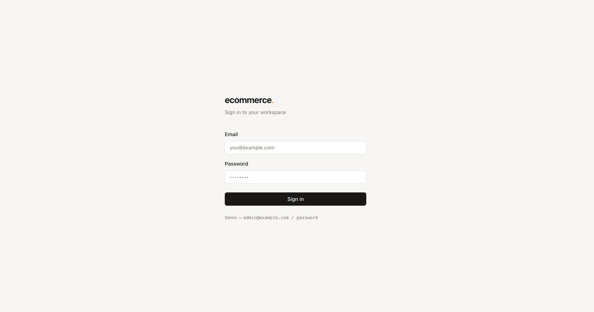
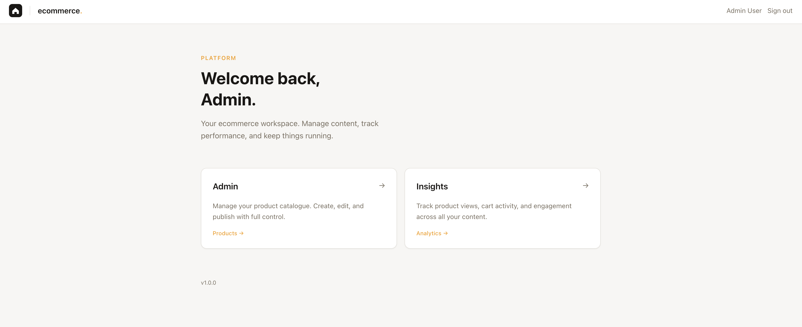
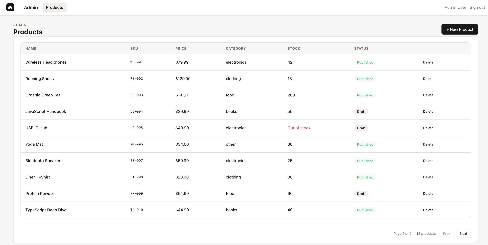
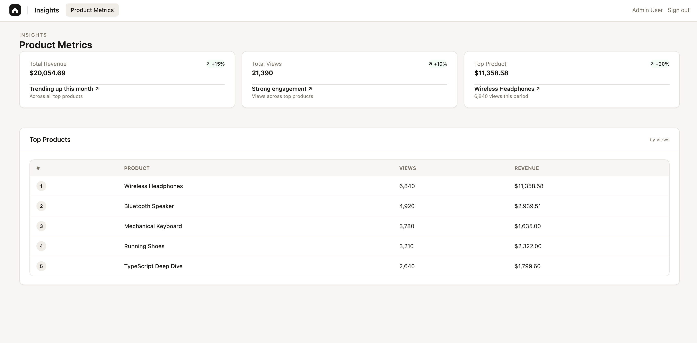

# Module Federation — Production Micro-Frontend Architecture

A production-grade micro-frontend monorepo built with **React 19**, **Module Federation 2.0**, **Rspack**, and **NX**. Three independently deployable apps share a design system, auth state, and UI components at runtime — without bundling them together.

---

## Preview

<p align="center">
  
  <br />
  
  <br />
  
  <br />
  
</p>

---

## Table of Contents

1. [What is Module Federation?](#what-is-module-federation)
2. [Architecture Overview](#architecture-overview)
3. [Project Structure](#project-structure)
4. [Core Concepts](#core-concepts)
   - [Host vs Remote](#host-vs-remote)
   - [Exposed Modules](#exposed-modules)
   - [Shared Singletons](#shared-singletons)
   - [The Bootstrap Pattern](#the-bootstrap-pattern)
   - [Remote Type Declarations](#remote-type-declarations)
5. [Rspack Configuration Deep Dive](#rspack-configuration-deep-dive)
   - [Host Config](#host-config)
   - [Remote Config (Admin)](#remote-config-admin)
   - [Remote Config (Insights)](#remote-config-insights)
6. [Runtime Flow](#runtime-flow)
7. [Authentication Across Remotes](#authentication-across-remotes)
8. [Shared UI Library](#shared-ui-library)
9. [State Management Pattern](#state-management-pattern)
10. [Feature Module Pattern](#feature-module-pattern)
11. [NX Monorepo Integration](#nx-monorepo-integration)
12. [Getting Started](#getting-started)
13. [Key Takeaways](#key-takeaways)

---

## What is Module Federation?

Module Federation is a Webpack/Rspack feature that lets multiple independently built and deployed JavaScript applications share code **at runtime** — not at build time.

Before Module Federation, sharing code between apps meant:

- Publishing an npm package and coordinating version upgrades across repos
- Building everything in one monolith (defeats independent deployment)
- Using iframes (isolated but terrible DX — no shared state, styles, or routing)

With Module Federation, App A can **expose** a React component and App B can **import** it directly from App A's production server while both apps are running. No npm publish. No shared build step.

```
┌──────────────────────────────────┐
│  Browser                         │
│                                  │
│  Host (4200) loads the page      │
│     │                            │
│     ├─ lazy import admin/AdminShell ──► fetches remoteEntry.js from :4201
│     │                                  downloads AdminShell chunk on demand
│     │                                  React, ReactRouter already loaded → skipped (singleton)
│     │
│     └─ lazy import insights/InsightsShell ──► fetches remoteEntry.js from :4202
└──────────────────────────────────┘
```

---

## Architecture Overview

```
┌─────────────────────────────────────────────────────────┐
│                   HOST  :4200                           │
│                                                         │
│  ┌──────────┐  ┌───────────┐  ┌──────────────────────┐ │
│  │  Login   │  │ Landing   │  │  AppHeader (exposed)  │ │
│  │  Screen  │  │   Page    │  │  AuthProvider (exp.)  │ │
│  └──────────┘  └───────────┘  └──────────────────────┘ │
│                                                         │
│        /admin/*                    /insights/*          │
│           │                             │               │
│    <Suspense>                    <Suspense>              │
│    <ErrorBoundary>               <ErrorBoundary>        │
│           │                             │               │
└───────────┼─────────────────────────────┼───────────────┘
            │  lazy()                     │  lazy()
            ▼                             ▼
┌───────────────────┐        ┌────────────────────────┐
│  ADMIN  :4201     │        │  INSIGHTS  :4202        │
│                   │        │                         │
│  ProductList      │        │  ProductMetrics         │
│  ProductCreate    │        │  Dashboard              │
│  ProductForm      │        │  MetricCard             │
│  ProductTable     │        │  TopProductsCards       │
└───────────────────┘        │  TopProductsList        │
                             └────────────────────────┘

           ┌──────────────────────────────────┐
           │  SHARED PACKAGES (not federated) │
           │  @repo/ui    — design system      │
           │  @repo/utils — formatters etc.    │
           │  @repo/mocks — dev mock data      │
           └──────────────────────────────────┘
```

**Ports:**
| App | URL | Role |
|-----|-----|------|
| host | http://localhost:4200 | Shell: routing, auth, navigation |
| admin | http://localhost:4201 | Remote: product CRUD |
| insights | http://localhost:4202 | Remote: analytics dashboard |

---

## Project Structure

```
module-federation/
├── apps/
│   ├── host/                        # Shell application
│   │   ├── rspack.config.ts         # MF: exposes AuthProvider + AppHeader
│   │   └── src/
│   │       ├── main.tsx             # dynamic import('./bootstrap')
│   │       ├── bootstrap.tsx        # createRoot entry
│   │       ├── App.tsx              # BrowserRouter + Routes
│   │       ├── remotes.d.ts         # TypeScript declarations for remotes
│   │       ├── globals.d.ts         # declare __APP_VERSION__
│   │       ├── components/
│   │       │   ├── AppHeader.tsx    # Sticky header (exposed via MF)
│   │       │   ├── ErrorBoundary.tsx
│   │       │   └── NavCard.tsx
│   │       ├── pages/
│   │       │   └── LandingPage.tsx
│   │       └── features/auth/
│   │           ├── api/auth.api.ts      # mock login/refresh/token
│   │           ├── stores/authStore.ts  # Zustand store (exposed via MF)
│   │           ├── components/RequireAuth.tsx
│   │           ├── screens/LoginScreen.tsx
│   │           └── types/auth.types.ts
│   │
│   ├── admin/                       # Remote: product management
│   │   ├── rspack.config.ts         # MF: exposes AdminShell, consumes host
│   │   └── src/
│   │       ├── AdminShell.tsx       # Exposed entry component
│   │       ├── remotes.d.ts         # Types for host/AppHeader, host/AuthProvider
│   │       ├── components/AppLayout.tsx  # uses host/AppHeader + host/AuthProvider
│   │       ├── constants/index.ts   # PAGE_SIZE
│   │       ├── defs/index.ts        # Product, PaginatedResult types
│   │       └── features/products/
│   │           ├── api/products.api.ts
│   │           ├── store/products.store.ts
│   │           ├── actions/products.actions.ts
│   │           ├── components/
│   │           │   ├── ProductForm.tsx
│   │           │   ├── ProductTable.tsx
│   │           │   ├── ProductStatusBadge.tsx
│   │           │   └── product.schema.ts
│   │           └── screens/
│   │               ├── ProductList.tsx
│   │               └── ProductCreate.tsx
│   │
│   └── insights/                    # Remote: analytics
│       ├── rspack.config.ts         # MF: exposes InsightsShell, consumes host
│       └── src/
│           ├── InsightsShell.tsx    # Exposed entry component
│           ├── remotes.d.ts
│           ├── components/AppLayout.tsx
│           ├── defs/index.ts        # ProductMetrics types
│           └── features/productMetrics/
│               ├── api/productMetrics.api.ts
│               ├── store/productMetrics.store.ts
│               ├── actions/productMetrics.actions.ts
│               ├── components/
│               │   ├── MetricCard.tsx
│               │   ├── TopProductsCards.tsx
│               │   └── TopProductsList.tsx
│               └── screens/ProductMetricsDashboard.tsx
│
├── packages/
│   ├── ui/                          # @repo/ui — shared design system
│   │   └── src/
│   │       ├── index.ts             # barrel export
│   │       ├── components/          # Badge, Button, Card, Input, NavItem,
│   │       │                        # Select, Table, Textarea
│   │       └── theme/               # colors, sizes
│   ├── utils/                       # @repo/utils — utility functions
│   │   └── src/
│   │       ├── formatters.ts        # formatCurrency, formatDate, ...
│   │       ├── validators.ts        # isEmail, isEmpty, ...
│   │       └── http.ts              # httpClient fetch wrapper
│   └── mocks/                       # @repo/mocks — dev mock data
│       └── src/
│           ├── auth.mocks.ts
│           ├── products.mocks.ts
│           └── metrics.mocks.ts
│
├── nx.json                          # NX task orchestration
├── tsconfig.base.json               # Root TS config with path aliases
└── package.json                     # Workspaces root
```

---

## Core Concepts

### Host vs Remote

**Host** = the app that loads others. It owns the URL bar, the router, and decides which remotes to show.

**Remote** = an app that exposes components to be consumed by a host. A remote can also consume modules from the host (bidirectional federation).

```
Host consumes:  admin/AdminShell, insights/InsightsShell
Admin consumes: host/AuthProvider, host/AppHeader
Insights consumes: host/AuthProvider, host/AppHeader
```

This bidirectionality is what makes remotes feel like native parts of the shell — they use the same header and the same auth state as the host, but their code lives in a separate deployment.

---

### Exposed Modules

In the `ModuleFederationPlugin` config, `exposes` maps a public name to a local file path:

```ts
// apps/host/rspack.config.ts
new ModuleFederationPlugin({
  name: 'host',
  filename: 'remoteEntry.js', // manifest file consumers fetch first
  exposes: {
    './AuthProvider': './src/features/auth/stores/authStore',
    './AppHeader': './src/components/AppHeader',
  },
  // ...
});
```

```ts
// apps/admin/rspack.config.ts
new ModuleFederationPlugin({
  name: 'admin',
  filename: 'remoteEntry.js',
  exposes: {
    './AdminShell': './src/AdminShell', // the component host lazy-loads
  },
  remotes: {
    host: 'host@http://localhost:4200/remoteEntry.js',
  },
  // ...
});
```

`remoteEntry.js` is a small manifest file generated at build time. When the host tries to `import('admin/AdminShell')`, the browser first fetches `http://localhost:4201/remoteEntry.js` to discover which chunks contain `AdminShell`, then downloads only those chunks.

---

### Shared Singletons

Without `shared`, every app would bundle its own copy of React. Two React instances in the same page = hooks fail, context doesn't work.

```ts
shared: {
  react: {
    singleton: true,   // only one instance allowed across all remotes
    eager: true,       // load it synchronously with the host (not lazy)
    requiredVersion: '^19.1.0',
  },
  'react-dom': { singleton: true, eager: true, requiredVersion: '^19.1.0' },
  'react-router-dom': { singleton: true, eager: true, requiredVersion: '^6.30.0' },
},
```

**`singleton: true`** — if multiple remotes try to load different versions, Module Federation will use the highest compatible version and warn about the rest.

**`eager: true`** — normally shared deps are async (they show up in a separate chunk). `eager: true` puts them in the entry chunk, which is why we need the bootstrap pattern (see below).

**What is NOT shared** — `@repo/ui`, `@repo/utils`, `@repo/mocks`. These are resolved at build time via webpack aliases pointing directly at source files, so each app compiles them in. They don't need to be shared because they have no singleton constraint and they're small enough.

---

### The Bootstrap Pattern

This is the most important pattern to understand. Without it, eager shared modules cause a runtime error.

**The problem:** When `eager: true`, Webpack/Rspack needs to load React synchronously _before_ executing the entry file. But the entry file itself imports React. This circular dependency causes a "Shared module is not available for eager consumption" error.

**The fix:** A two-file split.

```ts
// apps/host/src/main.tsx  ← actual entry point
// This file contains NO imports. It only does a dynamic import.
import('./bootstrap');
// The dynamic import boundary gives the Module Federation runtime
// time to initialize all shared modules before bootstrap.tsx runs.
```

```tsx
// apps/host/src/bootstrap.tsx  ← real application code
import { StrictMode } from 'react'; // safe to import here
import { createRoot } from 'react-dom/client';
import App from './App';
import './styles/globals.css';

createRoot(document.getElementById('root')!).render(
  <StrictMode>
    <App />
  </StrictMode>
);
```

The async `import()` in `main.tsx` creates a chunk boundary. By the time `bootstrap.tsx` executes, the MF runtime has already resolved and initialized React as a shared singleton.

---

### Remote Type Declarations

TypeScript doesn't know about modules that exist only at runtime on another server. We add manual `.d.ts` declarations to make imports type-safe.

```ts
// apps/host/src/remotes.d.ts
declare module 'admin/AdminShell' {
  const AdminShell: React.ComponentType;
  export default AdminShell;
}

declare module 'insights/InsightsShell' {
  const InsightsShell: React.ComponentType;
  export default InsightsShell;
}
```

```ts
// apps/admin/src/remotes.d.ts
declare module 'host/AppHeader' {
  import type { ReactNode } from 'react';
  interface AppHeaderProps {
    brand: ReactNode;
    nav?: ReactNode;
    actions?: ReactNode;
  }
  const AppHeader: (props: AppHeaderProps) => JSX.Element;
  export default AppHeader;
}

declare module 'host/AuthProvider' {
  export function useAuthStore<T>(selector: (state: unknown) => T): T;
}
```

These declarations let TypeScript verify usage of remote modules at compile time even though the actual code lives on a different server.

---

## Rspack Configuration Deep Dive

### Host Config

```ts
// apps/host/rspack.config.ts
import path from 'node:path';
import { fileURLToPath } from 'node:url';
import { ModuleFederationPlugin } from '@module-federation/enhanced/rspack';
import * as rspack from '@rspack/core';
import ReactRefreshPlugin from '@rspack/plugin-react-refresh';

const __dirname = path.dirname(fileURLToPath(import.meta.url));
const root = path.resolve(__dirname, '../..');
const isDev = process.env.NODE_ENV !== 'production';

export default {
  entry: './src/bootstrap.tsx', // NOT main.tsx — see bootstrap pattern
  output: {
    filename: isDev ? '[name].js' : '[name].[contenthash].js',
    publicPath: 'http://localhost:4200/', // remotes need this to fetch chunks
    clean: true,
  },
  resolve: {
    alias: {
      '@host': path.resolve(__dirname, 'src'),
      '@repo/ui': path.resolve(root, 'packages/ui/src/index.ts'),
      '@repo/utils': path.resolve(root, 'packages/utils/src/index.ts'),
      '@repo/mocks': path.resolve(root, 'packages/mocks/src/index.ts'),
    },
  },
  plugins: [
    new rspack.HtmlRspackPlugin({ template: './index.html' }),
    new rspack.DefinePlugin({ __APP_VERSION__: JSON.stringify('1.0.0') }),
    new ModuleFederationPlugin({
      name: 'host',
      filename: 'remoteEntry.js',
      dts: false,
      exposes: {
        './AuthProvider': './src/features/auth/stores/authStore',
        './AppHeader': './src/components/AppHeader',
      },
      remotes: {
        admin: 'admin@http://localhost:4201/remoteEntry.js',
        insights: 'insights@http://localhost:4202/remoteEntry.js',
      },
      shared: {
        react: { singleton: true, eager: true, requiredVersion: '^19.1.0' },
        'react-dom': {
          singleton: true,
          eager: true,
          requiredVersion: '^19.1.0',
        },
        'react-router-dom': {
          singleton: true,
          eager: true,
          requiredVersion: '^6.30.0',
        },
      },
    }),
    ...(isDev ? [new ReactRefreshPlugin()] : []),
  ],
  devServer: {
    port: 4200,
    hot: true,
    historyApiFallback: true, // SPA routing — all paths serve index.html
    headers: { 'Access-Control-Allow-Origin': '*' }, // remotes fetch chunks cross-origin
    client: {
      overlay: {
        runtimeErrors: (error) =>
          !error.message.includes('Failed to get manifest'), // suppress harmless MF warnings
      },
    },
  },
  experiments: { css: true },
} satisfies rspack.Configuration;
```

### Remote Config (Admin)

```ts
// apps/admin/rspack.config.ts
new ModuleFederationPlugin({
  name: 'admin', // must match the key used in host's remotes: { admin: '...' }
  filename: 'remoteEntry.js',
  dts: false,
  exposes: {
    './AdminShell': './src/AdminShell', // host imports 'admin/AdminShell'
  },
  remotes: {
    host: 'host@http://localhost:4200/remoteEntry.js', // for consuming host/AppHeader etc.
  },
  shared: {
    /* same shared block as host */
  },
});
```

Remote `name` must exactly match the key used in the consuming app's `remotes` config. `admin` here matches `remotes: { admin: 'admin@...' }` in the host.

### Remote Config (Insights)

Identical pattern to admin, with `name: 'insights'`, port 4202, and exposing `./InsightsShell`.

---

## Runtime Flow

Here is what happens step-by-step when a user navigates to `http://localhost:4200/admin`:

```
1. Browser loads host index.html
2. main.js executes: import('./bootstrap')
   └─ MF runtime initializes, registers shared singletons (React, ReactDOM, ReactRouter)
3. bootstrap.tsx executes, mounts <App />
4. React renders <BrowserRouter> → <Routes>
5. Route /admin/* matches → React starts rendering:
   <RequireAuth>        ← checks authStore.isAuthenticated
     <ErrorBoundary>    ← catches remote load failures
       <Suspense>       ← shows spinner while remote loads
         <AdminShell /> ← lazy(() => import('admin/AdminShell'))
6. React.lazy() triggers the dynamic import:
   a. Fetch http://localhost:4201/remoteEntry.js  (manifest)
   b. Parse manifest → find which chunk contains AdminShell
   c. Fetch that chunk
   d. Check shared deps: React already loaded → SKIP. ReactRouter already loaded → SKIP.
   e. Execute AdminShell chunk
7. <AdminShell /> renders — it imports from 'host/AuthProvider':
   a. 'host/AuthProvider' is already loaded (we're in the host) → returns cached module
   b. useAuthStore() returns the existing Zustand store instance (shared singleton)
8. Admin renders its own <Routes> for /products and /products/create
```

The key insight at step 7b: because `react` and `react-dom` are singletons and `useAuthStore` is a module loaded from the host, the **same Zustand store instance** is shared between host and admin. There is no `postMessage`, no prop drilling across app boundaries — it just works like a regular import.

---

## Authentication Across Remotes

The host exposes its Zustand auth store. Remotes consume it:

```ts
// apps/host/src/features/auth/stores/authStore.ts
export const useAuthStore = create<AuthStore>((set) => ({
  user: null,
  token: null,
  isAuthenticated: false,
  isLoading: !!storedToken, // true while refreshing session on page load

  login: async (credentials) => {
    const { token, user } = await loginRequest(credentials);
    storeToken(token);
    set({ user, token, isAuthenticated: true, isLoading: false });
  },

  logout: () => {
    clearToken();
    set({ user: null, token: null, isAuthenticated: false, isLoading: false });
  },
}));

// On store creation: if a token exists in localStorage, attempt silent refresh
if (storedToken) {
  refreshRequest(storedToken).then((user) => {
    if (user)
      set({
        user,
        token: storedToken,
        isAuthenticated: true,
        isLoading: false,
      });
    else {
      clearToken();
      set({ isLoading: false });
    }
  });
}
```

```ts
// apps/host/rspack.config.ts
exposes: {
  './AuthProvider': './src/features/auth/stores/authStore',
}
```

```ts
// apps/admin/src/components/AppLayout.tsx
import { useAuthStore } from 'host/AuthProvider'; // live module from host's bundle

const { user, logout } = useAuthStore(
  useShallow((s) => ({ user: s.user, logout: s.logout }))
);
// This is the exact same store instance the host uses.
// When the host logs out, this component re-renders automatically.
```

The same `useAuthStore` instance is shared because:

1. `host` is listed as a remote in admin's MF config
2. Module Federation caches loaded modules — `host/AuthProvider` loads once and is reused
3. Zustand stores are module-level singletons — one store, many subscribers

---

## Shared UI Library

`@repo/ui` is resolved via a webpack alias — it's not federated, it's compiled into each app at build time. This is intentional: shared packages don't need runtime sharing because they have no singleton constraint.

```ts
// tsconfig.base.json — path aliases for TypeScript
"paths": {
  "@repo/ui":    ["packages/ui/src/index.ts"],
  "@repo/utils": ["packages/utils/src/index.ts"],
  "@repo/mocks": ["packages/mocks/src/index.ts"]
}

// rspack.config.ts — aliases for bundler
alias: {
  '@repo/ui':    path.resolve(root, 'packages/ui/src/index.ts'),
  '@repo/utils': path.resolve(root, 'packages/utils/src/index.ts'),
  '@repo/mocks': path.resolve(root, 'packages/mocks/src/index.ts'),
}
```

Usage is identical to an npm package import:

```tsx
import { Button, Card, Table, Badge, Input, Select, Textarea } from '@repo/ui';
import { formatCurrency } from '@repo/utils';
import { MOCK_PRODUCTS } from '@repo/mocks';
```

**Component API examples:**

```tsx
// Card — compound component pattern
<Card>
  <Card.Header>
    <Card.Title>Products</Card.Title>
    <span>subtitle</span>
  </Card.Header>
  <Card.Body>content</Card.Body>
  <Card.Footer>
    <Button variant="secondary" size="sm">Cancel</Button>
    <Button size="md">Save</Button>
  </Card.Footer>
</Card>

// Table — compound component pattern
<Table>
  <Table.Head>
    <Table.Row>
      <Table.Th>Name</Table.Th>
      <Table.Th>Price</Table.Th>
    </Table.Row>
  </Table.Head>
  <Table.Body>
    {products.map(p => (
      <Table.Row key={p.id}>
        <Table.Td>{p.name}</Table.Td>
        <Table.Td>{formatCurrency(p.price)}</Table.Td>
      </Table.Row>
    ))}
  </Table.Body>
</Table>

// Button variants
<Button>Primary</Button>
<Button variant="secondary">Secondary</Button>
<Button variant="ghost" size="sm">Ghost</Button>
<Button variant="danger" loading={isDeleting}>Delete</Button>

// Badge variants
<Badge variant="success">Published</Badge>
<Badge variant="default">Draft</Badge>
<Badge variant="danger">Error</Badge>
```

---

## State Management Pattern

Each feature owns a Zustand store + a separate actions file. The store is pure state (no side effects); actions import the store via `getState()` and call the API.

```ts
// store — pure state + setters only
export const useProductsStore = create<ProductsState & ProductsActions>(
  (set) => ({
    result: null,
    isLoading: false,
    error: null,
    page: 1,

    setResult: (result) => set({ result }),
    setLoading: (isLoading) => set({ isLoading }),
    setError: (error) => set({ error }),
    setPage: (page) => set({ page }),
  })
);
```

```ts
// actions — orchestration: api call → update store
const store = () => useProductsStore.getState();

export async function loadProducts(page = store().page) {
  store().setLoading(true);
  store().setError(null);
  try {
    const data = await fetchProducts(page);
    store().setResult(data);
    store().setPage(page);
  } catch {
    store().setError('Failed to load products');
  } finally {
    store().setLoading(false);
  }
}
```

```tsx
// component — subscribe with useShallow to prevent unnecessary re-renders
const { result, isLoading, error, page } = useProductsStore(
  useShallow((s) => ({
    result: s.result,
    isLoading: s.isLoading,
    error: s.error,
    page: s.page,
  }))
);

useEffect(() => {
  loadProducts();
}, []);
```

**Why `useShallow`?** Without it, the component re-renders every time any store value changes (even unrelated ones). `useShallow` does a shallow equality check on the selected object, so the component only re-renders when `result`, `isLoading`, `error`, or `page` actually change.

---

## Feature Module Pattern

Each feature follows the same internal structure:

```
features/products/
├── api/           ← async functions that talk to the "server" (mock or real)
│   └── products.api.ts
├── store/         ← Zustand store: state + setters, no logic
│   └── products.store.ts
├── actions/       ← orchestration: call api, update store, handle errors
│   └── products.actions.ts
├── components/    ← reusable UI pieces for this feature
│   ├── ProductForm.tsx
│   ├── ProductTable.tsx
│   ├── ProductStatusBadge.tsx
│   └── product.schema.ts   ← Yup validation schema
└── screens/       ← page-level components, imported by the Shell router
    ├── ProductList.tsx
    └── ProductCreate.tsx
```

The Shell component (`AdminShell.tsx`) only knows about screens, not feature internals:

```tsx
// apps/admin/src/AdminShell.tsx
const AdminShell = () => (
  <AppLayout>
    <Routes>
      <Route index element={<Navigate to="products" replace />} />
      <Route path="products" element={<ProductList />} />
      <Route path="products/create" element={<ProductCreate />} />
    </Routes>
  </AppLayout>
);

export default AdminShell; // this is what the host lazy-loads
```

---

## NX Monorepo Integration

NX provides task orchestration — it knows the dependency graph between projects and runs tasks in the right order.

```json
// packages/ui/project.json
{
  "name": "ui",
  "projectType": "library",
  "targets": {
    "build": { "executor": "nx:run-commands", "options": { "command": "vite build", "cwd": "packages/ui" } }
  }
}

// apps/host/project.json
{
  "name": "host",
  "projectType": "application",
  "implicitDependencies": ["ui", "utils"],  // NX knows host depends on these
  "targets": {
    "build": {
      "dependsOn": [{ "projects": ["ui", "utils"], "target": "build" }],
      "options": { "command": "rspack build --node-env production", "cwd": "apps/host" }
    },
    "serve": {
      "options": { "command": "rspack serve --node-env development", "cwd": "apps/host" }
    }
  }
}
```

```json
// nx.json — global task defaults
{
  "targetDefaults": {
    "build": {
      "cache": true, // nx caches build outputs — second build is instant
      "dependsOn": ["^build"] // always build dependencies first
    }
  }
}
```

**Why NX for this project?** Without NX, you'd have to manually run `vite build` in `packages/ui`, then `vite build` in `packages/utils`, then start each app — and remember the right order. `nx serve host` handles the whole graph automatically.

---

## Getting Started

### Prerequisites

- Node.js v20+
- npm v10+

### Install

```bash
npm install
```

### Development (3 terminals)

```bash
# Terminal 1 — host shell
npm run serve:host      # http://localhost:4200

# Terminal 2 — admin remote
npm run serve:admin     # http://localhost:4201

# Terminal 3 — insights remote
npm run serve:insights  # http://localhost:4202
```

All three must be running. The host fetches `remoteEntry.js` from admin and insights at runtime.

### Login

Navigate to `http://localhost:4200`. You will be redirected to `/login`.

| Email              | Password | Role   |
| ------------------ | -------- | ------ |
| admin@example.com  | password | admin  |
| viewer@example.com | password | viewer |

### Production Build

```bash
npm run build   # builds all apps via NX (respects dependency order)
```

### Individual App Commands

```bash
# Serve a single app (useful for isolated remote development)
cd apps/admin && npx rspack serve --node-env development

# Build a single app
cd apps/host && npx rspack build --node-env production
```

---

## Key Takeaways

| Concept                      | Summary                                                                                 |
| ---------------------------- | --------------------------------------------------------------------------------------- |
| **Module Federation**        | Share code between apps at runtime, not build time                                      |
| **`remoteEntry.js`**         | Manifest file each remote exposes — consumed by the host to discover chunks             |
| **`singleton: true`**        | Ensures one React/ReactRouter instance across all remotes                               |
| **`eager: true`**            | Load shared dep synchronously — requires the bootstrap pattern                          |
| **Bootstrap pattern**        | `main.tsx` only does `import('./bootstrap')` to give MF runtime time to initialize      |
| **Bidirectional federation** | Remotes can consume from the host (shared AppHeader, AuthProvider)                      |
| **Remote type declarations** | `.d.ts` files in each app declare the shape of modules from other remotes               |
| **Aliases, not federation**  | `@repo/ui` is compiled in at build time via alias — no runtime sharing needed           |
| **Actions pattern**          | Pure stores + separate action functions that call API and update store via `getState()` |
| **`useShallow`**             | Prevents re-renders when unrelated store fields change                                  |
| **NX**                       | Task orchestration — builds dependencies in correct order, caches results               |

### Common Pitfalls

**"Shared module is not available for eager consumption"**
→ You forgot the bootstrap pattern. Your entry file imports React directly. Use the `main.tsx → import('./bootstrap')` split.

**Remote not loading / CORS errors**
→ All dev servers need `headers: { 'Access-Control-Allow-Origin': '*' }` in their devServer config.

**Two React instances error**
→ Missing `singleton: true` on the `react` shared dep, or one app has a different major version.

**TypeScript errors on `import('admin/AdminShell')`**
→ Add a `declare module 'admin/AdminShell'` block to your `remotes.d.ts`.

**Remote loads fine in isolation but breaks inside host**
→ Check that the remote's `publicPath` in `output` points to the correct port. Chunks are fetched relative to `publicPath`.
