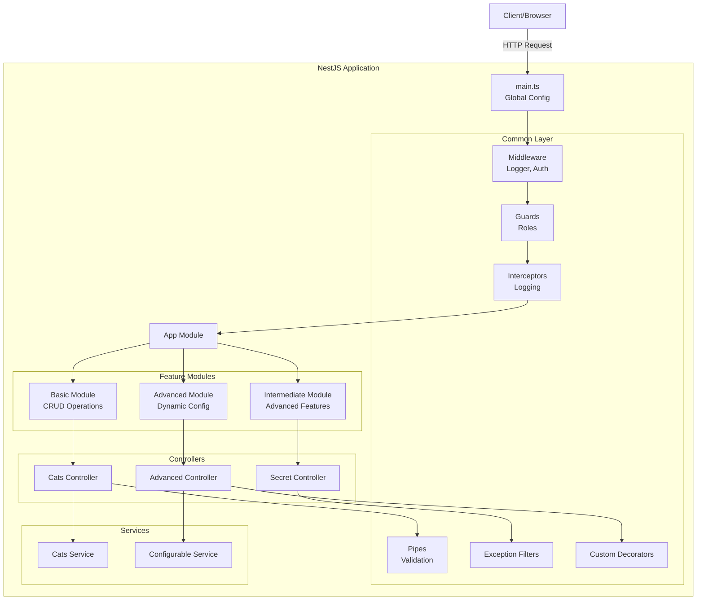

# NestJS Learning Project

A modular, production-ready NestJS starter project designed to teach basic, intermediate, and advanced concepts.

## 📚 Key Concepts & Definitions

### Core Building Blocks

- **Module**: A class annotated with `@Module()`. It organizes the application structure. Every Nest application has at least one module (the root module).
- **Controller**: A class annotated with `@Controller()`. It handles incoming **requests** and returns **responses** to the client.
- **Provider**: A fundamental concept in Nest. Many Nest classes may be treated as providers (services, repositories, factories, helpers, etc.). The main idea of a provider is that it can be **injected** as a dependency.
- **Service**: A common type of provider. It contains **business logic** and is separated from the controller to keep code clean and testable.

### Data & Validation

- **DTO (Data Transfer Object)**: An object that defines how data will be sent over the network. We use classes with `class-validator` decorators (e.g., `@IsString()`, `@IsInt()`) to ensure data integrity.
- **Pipe**: A class annotated with `@Injectable()` and implementing `PipeTransform`. Pipes are used for **transformation** (e.g., string to integer) and **validation** of input data.

### Request Lifecycle Components

- **Middleware**: A function called **before** the route handler. It has access to the request and response objects. Used for logging, header modification, etc.
- **Guard**: A class annotated with `@Injectable()` and implementing `CanActivate`. Guards determine whether a request will be handled by the route handler or not (e.g., **Authentication**, **Authorization**).
- **Interceptor**: A class annotated with `@Injectable()` and implementing `NestInterceptor`. Interceptors can bind extra logic **before and after** the method execution. Used for logging execution time, transforming responses, or handling timeouts.
- **Exception Filter**: A class annotated with `@Catch()`. It processes unhandled exceptions thrown during request processing and sends a user-friendly response.

### Advanced Concepts

- **Dynamic Module**: A module that can be created dynamically with configuration options (e.g., `ConfigModule.forRoot(...)`).
- **Decorator**: A function that adds metadata to classes, methods, or properties. NestJS uses decorators extensively (e.g., `@Get()`, `@Body()`). You can also create **Custom Decorators**.
- **Injection Scopes**: Detailed control over provider lifecycle:
  - **Singleton (Default)**: One instance shared across the app.
  - **Request**: New instance for each request.
  - **Transient**: New instance for each injection.

## 📂 Project Structure

```
src/
├── common/           # Shared logic (Guards, Pipes, Filters, etc.)
│   ├── decorators/   # Custom decorators (@User)
│   ├── filters/      # Global exception filters
│   ├── guards/       # Role-based guards
│   ├── interceptors/ # Logging interceptors
│   ├── middleware/   # Logger middleware
│   └── pipes/        # Custom validation/transformation pipes
├── config/           # Configuration modules
├── modules/          # Feature-specific modules
│   ├── basic/        # CRUD examples (Cats)
│   ├── intermediate/ # Middleware, Guards, Interceptors usage
│   └── advanced/     # Dynamic modules
└── main.ts           # Application entry point
```

## 🏗 Architecture Overview

This project demonstrates a **modular, layered architecture** following NestJS best practices:



### Request Flow

1. **Client** sends HTTP request
2. **Middleware** (Logger, Auth) processes request
3. **Guards** check authorization (e.g., role-based access)
4. **Interceptors** add pre/post-processing logic
5. **Pipes** validate and transform input data
6. **Controller** receives request and delegates to service
7. **Service** executes business logic
8. **Controller** returns response
9. **Exception Filters** catch and format errors

## 🚀 How to Run

### Prerequisites

- Node.js 20.19.4 or higher
- npm

### Installation & Development

```bash
# Install dependencies
npm install

# Run in development mode (with hot-reload)
npm run start:dev

# Run in production mode
npm run start:prod

# Build the project
npm run build
```

The server will start on `http://localhost:3000`.

### Available Endpoints

#### Basic Module (`/cats`)

```bash
# Get all cats
curl http://localhost:3000/cats

# Create a cat
curl -X POST http://localhost:3000/cats \
  -H "Content-Type: application/json" \
  -d '{"name":"Whiskers","age":3,"breed":"Persian"}'

# Get a specific cat
curl http://localhost:3000/cats/1

# Update a cat
curl -X PATCH http://localhost:3000/cats/1 \
  -H "Content-Type: application/json" \
  -d '{"age":4}'

# Delete a cat
curl -X DELETE http://localhost:3000/cats/1
```

#### Intermediate Module (`/secret`)

```bash
# Access protected route (requires admin role - mocked)
curl http://localhost:3000/secret

# Test FreezePipe
curl http://localhost:3000/secret/freeze

# Trigger exception filter
curl http://localhost:3000/secret/error
```

#### Advanced Module (`/advanced`)

```bash
# Get dynamic module configuration
curl http://localhost:3000/advanced/config

# Test custom @User() decorator
curl http://localhost:3000/advanced/user
```

## 🧪 Testing Workflow

### Linting

```bash
# Run ESLint
npm run lint

# Auto-fix linting issues
npm run lint -- --fix
```

### Unit Tests

```bash
# Run all tests
npm run test

# Run tests in watch mode
npm run test:watch

# Generate test coverage
npm run test:cov
```

### End-to-End Tests

```bash
# Run e2e tests
npm run test:e2e
```

### Manual Testing

Use the provided `curl` commands above or tools like:

- **Postman** / **Insomnia** for API testing
- **Thunder Client** (VS Code extension)
- Create a `.http` file with requests (VS Code REST Client extension)

Example `.http` file:

```http
### Get all cats
GET http://localhost:3000/cats

### Create a cat
POST http://localhost:3000/cats
Content-Type: application/json

{
  "name": "Fluffy",
  "age": 2,
  "breed": "Siamese"
}
```

## 📖 Learning Path

1. **Start with Basic Module** - Understand Controllers, Services, DTOs
2. **Explore Intermediate Module** - Learn Middleware, Guards, Pipes, Interceptors
3. **Study Advanced Module** - Master Dynamic Modules and Custom Decorators
4. **Read the Code** - Each file has comments explaining key concepts
5. **Experiment** - Modify endpoints, add new features, break things and fix them!

## 🛠 Tech Stack

- **Framework**: NestJS (Node.js)
- **Language**: TypeScript
- **Validation**: class-validator, class-transformer
- **Configuration**: @nestjs/config

## 📝 Additional Resources

- [Official NestJS Documentation](https://docs.nestjs.com/)
- [NestJS Fundamentals Course](https://learn.nestjs.com/)
- [TypeScript Handbook](https://www.typescriptlang.org/docs/)
