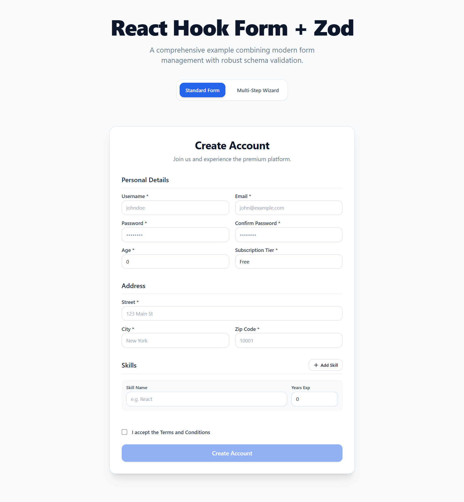
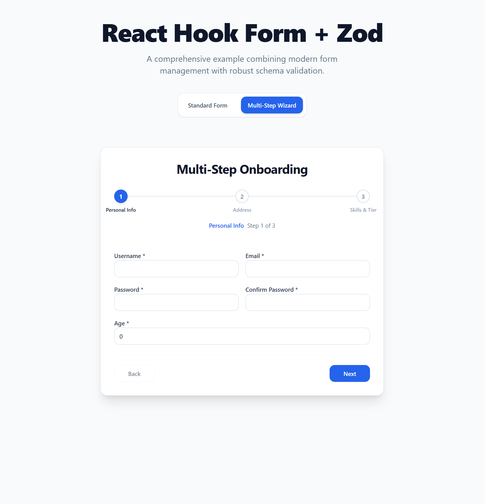

# React Hook Form + Zod Implementation Guide

A comprehensive, production-ready example of combining **React Hook Form** with **Zod** schema validation, styled elegantly with **Tailwind CSS**.

## Screenshots

<div align="center">
  
  
</div>

## Key Features Demonstrated

This project serves as an architectural blueprint for handling forms in React, covering major and complex use cases:

1. **Single Source of Truth Validation (Zod)**
   - Unified `registrationSchema` that handles standard types (strings, numbers), nested objects (`address`), arrays (`skills`), and strict refinements (password matching logic).

2. **Standard & Controlled Inputs**
   - Seamlessly binds native HTML inputs via `register()`.
   - Uses `<Controller />` for third-party or custom components, ensuring values and validation states remain perfectly synchronized.

3. **Dynamic Form Fields (`useFieldArray`)**
   - Implements dynamic array manipulation, allowing users to rapidly append or remove nested object structures dynamically.

4. **Multi-Step Wizard Flow**
   - Orchestrates a powerful Multi-Step form logic using `react-hook-form`'s `.trigger(['fields'])` method to independently validate chunks of the schema before allowing the user to proceed.
   - Refactored using the `<FormProvider />` pattern for maximum headless composability, mitigating prop drilling across deep component trees.

5. **Headless Primitive UI Components**
   - Encapsulates raw Tailwind CSS classes into clean, reusable form primitives (`<Input />`, `<Select />`, `<Button />`, `<Label />`).

## Getting Started

First, run the development server:

```bash
npm install
npm run dev
```

Open [http://localhost:5173](http://localhost:5173) with your browser to see the result. You can toggle between the Standard Form and the Multi-Step Form Wizard via the top navigation buttons.
