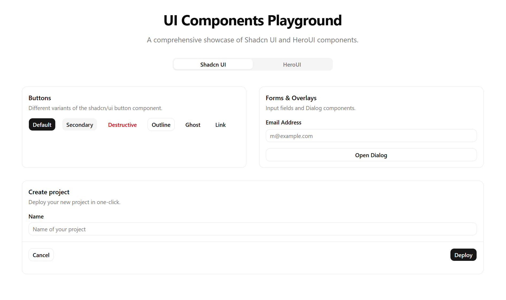
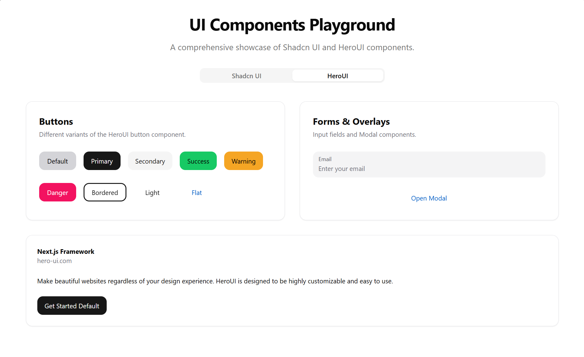

# UI Component Playground: Shadcn/UI + HeroUI

A high-performance, aesthetically pleasing playground for experimenting with and comparing two of the most popular React component libraries: **shadcn/ui** and **HeroUI**.

## 📸 Previews

| Tab 1: Shadcn/UI | Tab 2: HeroUI |
| :---: | :---: |
|  |  |

## 🚀 Overview

This project serves as a technical showcase and revision tool for modern frontend architectures. It integrates two distinct component philosophies:

- **shadcn/ui**: Copy-paste components built on top of **Base UI** (formerly Radix UI) for maximum flexibility and accessibility.
- **HeroUI**: A library formerly known as NextUI, focused on premium aesthetic and developer experience with a unified, opinionated design system.

---

## 🛠️ Tech Stack & Packages Used

This project leverages a curated selection of industry-leading packages to deliver a high-performance developer experience and a premium user interface.

| Package | Description | Key Features | Official Link |
| :--- | :--- | :--- | :--- |
| **React 19** | The latest evolved version of the world's most popular UI library. | Support for Actions, useOptimistic, and improved Metadata. | [Documentation](https://react.dev) |
| **Tailwind CSS** | A utility-first CSS framework that serves as the engine for all styling. | Type-safe design tokens, JIT compilation, and extreme flexibility. | [Official Site](https://tailwindcss.com) |
| **HeroUI (NextUI)** | A premium React UI library formerly known as NextUI, known for its "Wow" factor. | Built on React Aria, stunning default aesthetics, and smooth transitions. | [heroui.com](https://heroui.com) |
| **shadcn/ui** | Not a library, but a collection of re-usable components you copy and paste. | Zero vendor lock-in, full ownership of code, and Radix-based accessibility. | [ui.shadcn.com](https://ui.shadcn.com) |
| **Framer Motion** | Pro-level animation engine that powers the motion and physics of the UI. | Gesture support, layout animations, and declarative spring physics. | [framer.com](https://www.framer.com/motion/) |
| **Base UI** | The "headless" logic engine (by MUI) used for unstyled, accessible primitives. | Formerly Radix-inspired, focus on WAI-ARIA compliance without styles. | [base-ui.com](https://base-ui.com) |
| **Lucide React** | Clean, consistent, and feather-light icon set for modern web apps. | Tree-shakeable, SVG-based, and highly customizable via Tailwind. | [lucide.dev](https://lucide.dev) |
| **Zustand** | Small, fast, and scalable bear-bones state management solution. | Simplified store logic, modular patterns, and no boilerplate overhead. | [GitHub](https://github.com/pmndrs/zustand) |
| **Vite** | The lightning-fast build tool that powers the development workflow. | Hot Module Replacement (HMR) and optimized Rollup-based production builds. | [vite.dev](https://vite.dev) |

---

## ✨ Recommended UI Ecosystem (2025/2026)

Based on modern frontend architecture trends, these are the "Best-in-Class" packages to pair with this stack for a production-grade application:

- **[TanStack Table](https://tanstack.com/table)** - The gold standard for building powerful, headless, and accessible data grids.
- **[React Hook Form](https://react-hook-form.com/)** - High-performance, extensible forms with easy-to-use validation.
- **[Zod](https://zod.dev/)** - TypeScript-first schema declaration and validation library for type-safe APIs and forms.
- **[Sonner](https://sonner.emilkowal.ski/)** - An opinionated toast component for React, created by Emil Kowalski.
- **[Magic UI](https://magicui.design/)** - A collection of 20+ landing page components built with React, Typescript, Tailwind CSS, and Framer Motion.
- **[Aceternity UI](https://ui.aceternity.com/)** - Modern, complex UI components that make your website stand out from the crowd.
- **[Radix Colors](https://www.radix-ui.com/colors)** - An open-source color system for designing beautiful, accessible websites and apps.

---

## 🏗️ Architecture Principles

Following the **Shubham Dhage Playbook**:
- **Atomic Design**: Components are structured into modular, reusable units.
- **Strict TypeScript**: Type safety is enforced across the codebase to ensure maintainability.
- **Performance Driven**: Minimized bundle size and optimized rendering paths.
- **No Magic Numbers**: Design tokens are centralized in `tailwind.config.js` and `index.css`.

## ⚙️ Development

```bash
# Install dependencies (respects peer dependency requirements)
npm install --legacy-peer-deps

# Start development server
npm run dev

# Build for production
npm run build
```

---

## 🔧 Component Implementation Notes

### Shadcn/UI Components
Located in `src/components/ui`. These components are built with `@base-ui/react` to provide industry-standard accessibility (WAI-ARIA) while allowing full control over the visual presentation via Tailwind CSS.

### HeroUI Components
Directly imported from `@heroui/react`. These provide a "premium by default" experience with built-in animations and complex interactions.

---

## 📝 Definition of Done
- [x] Zero CSS syntax errors in production build.
- [x] Consistent layout across mobile and desktop.
- [x] Accessible interaction patterns for all UI triggers.
