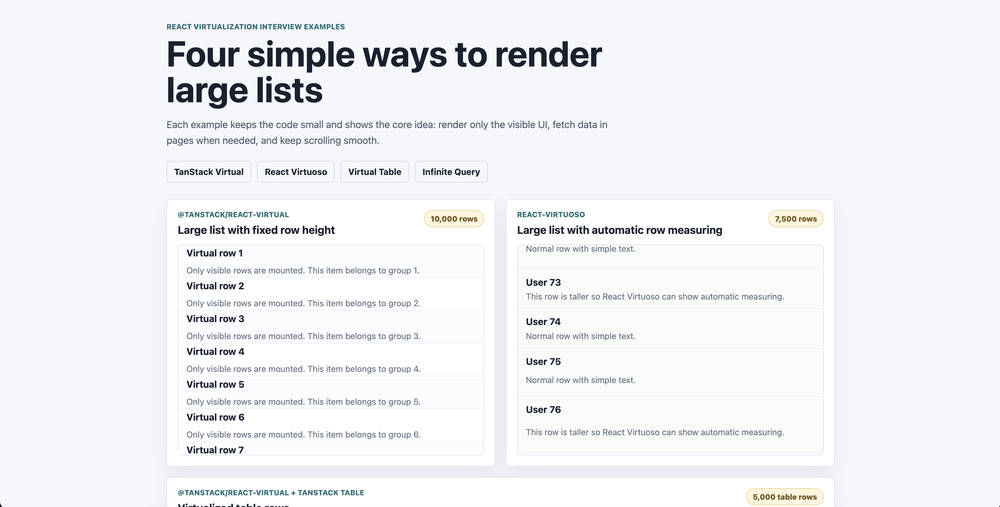
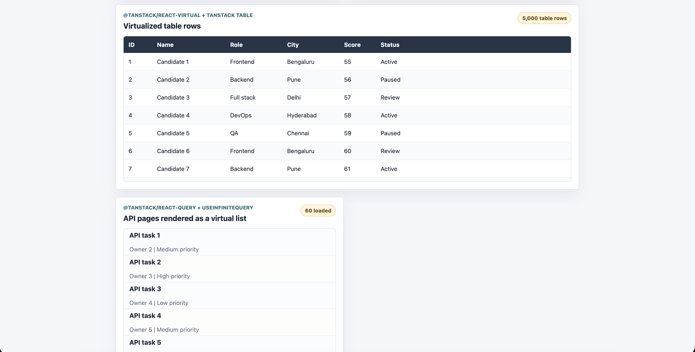

# Virtualization Libraries

Four interview-friendly React examples in one app:

- `@tanstack/react-virtual` for a large fixed-height list
- `react-virtuoso` for a large list with automatic row measurement
- `@tanstack/react-virtual` with `@tanstack/react-table` for table rows
- `@tanstack/react-query` with `useInfiniteQuery` for paged API data plus virtual rendering

## Preview




## Run

```bash
npm install
npm run dev
```

The app runs with Rsbuild at [http://localhost:3000](http://localhost:3000).

## What is virtualization?

Virtualization means rendering only the rows that are visible in the scroll
viewport, plus a few extra rows before and after the viewport. The user can
scroll through 10,000 rows, but React may only mount 15 to 40 row components at
one time.

Why it matters:

- Less DOM work
- Faster first render
- Smoother scrolling
- Lower memory usage

Important words:

- `viewport`: the visible scroll area
- `total size`: the full fake height of the list, used to keep the scrollbar correct
- `virtual item`: metadata for one visible row, such as `index`, `size`, and `start`
- `overscan`: extra rows rendered above and below the viewport to prevent blank flashes

## What is infinite scroll?

Infinite scroll loads data page by page as the user reaches the end of the
current list. It does not mean rendering every loaded row. For best performance,
combine infinite scroll with virtualization:

1. `useInfiniteQuery` fetches API pages.
2. The pages are flattened into one array.
3. The virtualizer renders only visible rows.
4. When the last loaded row becomes visible, the next API page is fetched.

## Example 1: `@tanstack/react-virtual`

File: `src/examples/TanStackVirtualList.tsx`

Best for:

- Maximum control over markup
- Lists, grids, tables, and custom layouts
- Interview explanations because the mechanics are visible

Core idea:

```tsx
const rowVirtualizer = useVirtualizer({
  count: rows.length,
  getScrollElement: () => parentRef.current,
  estimateSize: () => 56,
  overscan: 8,
});
```

The scroll container has a large inner canvas. Each visible row is absolutely
positioned with `transform: translateY(...)`.

## Example 2: `react-virtuoso`

File: `src/examples/ReactVirtuosoList.tsx`

Best for:

- Fast production list UIs
- Variable row heights
- Less manual setup
- Teams that want a higher-level component

Core idea:

```tsx
<Virtuoso data={users} itemContent={(_, user) => <div>{user.name}</div>} />
```

React Virtuoso automatically measures rows and manages the scroll math. You
mostly provide `data`, height, and `itemContent`.

## Example 3: TanStack Virtual + TanStack Table

File: `src/examples/TanStackTableVirtual.tsx`

Best for:

- Large data tables
- Keeping table state separate from rendering performance
- Sorting, filtering, column sizing, and row models from TanStack Table

Core idea:

```tsx
const table = useReactTable({
  data,
  columns,
  getCoreRowModel: getCoreRowModel(),
});

const rowVirtualizer = useVirtualizer({
  count: table.getRowModel().rows.length,
  getScrollElement: () => tableContainerRef.current,
  estimateSize: () => 44,
});
```

TanStack Table decides what rows exist. TanStack Virtual decides which of those
rows should be mounted for the current scroll position.

## Example 4: React Query `useInfiniteQuery` + virtual list

File: `src/examples/InfiniteQueryVirtualList.tsx`

Best for:

- API-backed feeds
- Search results
- Activity logs
- Dashboards that load data in pages

Core idea:

```tsx
const query = useInfiniteQuery({
  queryKey: ["tasks"],
  queryFn: ({ pageParam }) => fetchPage(pageParam),
  initialPageParam: 0,
  getNextPageParam: (lastPage) => lastPage.nextPage,
});
```

`useInfiniteQuery` stores each API response in `data.pages`. The example
flattens the pages into one list and asks for the next page when the last loaded
row appears in the virtual viewport.

## Which one is better?

There is no single winner.

- Use `@tanstack/react-virtual` when you want control and small primitives.
- Use `react-virtuoso` when you want the simplest list API, especially for
  variable-height rows.
- Use TanStack Table plus TanStack Virtual when the UI is a real data table.
- Use React Query when the main problem is server data, caching, retries,
  loading states, and fetching more pages.

## Build

```bash
npm run build
```
